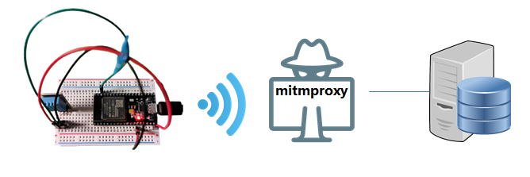
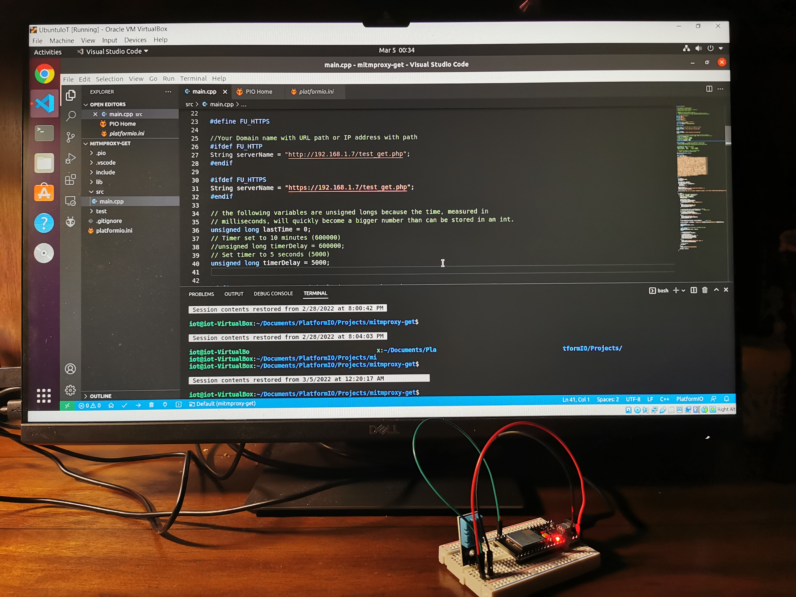
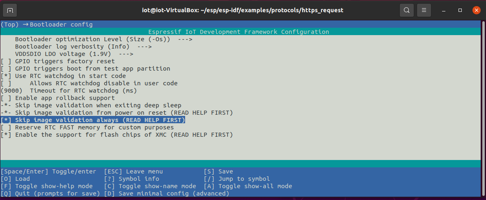
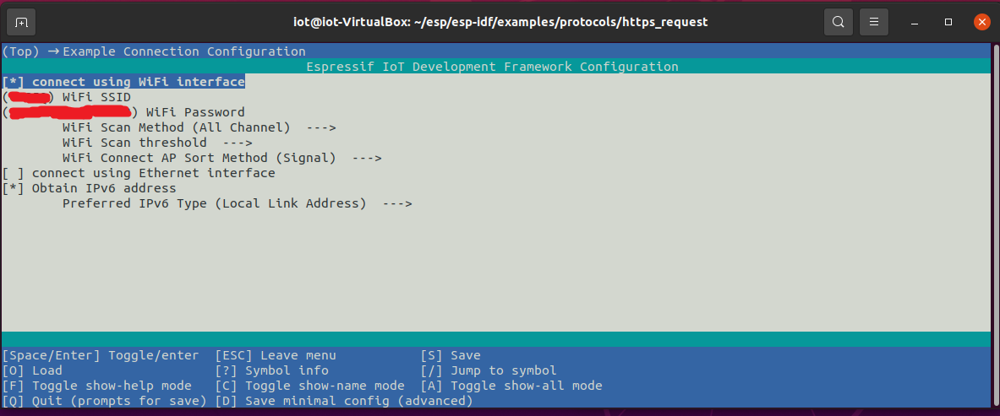

# MITM attacks against http and https through mitmproxy

In this project, we will learn using mitmproxy to monitor, and modify HTTP/HTTPS traffic manually, and how to use mitmdump with python script to modify HTTP/HTTPS query automatically. Those tools can be used for real attacks and for the purpose of understanding the communication protocol.

Mitmproxy is a set of SSL/TLS-capable proxy tools that can intercept HTTP/HTTPS, Websocket, and generic TCP flows. Mitmproxy tools contain three front-end tools, which work with the same core proxy. 
- *mitmproxy*: an interactive, SSL/TLS-capable intercepting proxy with a console interface.
- *mitmweb*: a web-based interface for mitmproxy.
- *mitmdump*: the command-line version of mitmproxy.

The figure below shows how the man-in-the-middle (MITM) attack works. Basically mitmproxy sits between the ESP32 and web server, and mitmproxy can intercept the http/https traffic. We demonstrate a simplified case: mitmproxy is hosted at the same computer as the web server. In reality, mitmproxy can be hosted at a standlone computer, which can work as the WiFi router, to which the esp32 will connect. In this way, we can intercept esp32 traffic and analyze the communication protocol.



# 1. Hardware setup
This project requires the ES32 board, the installation of adafruit/DHT sensor library within PlatformIO and apache web server at Ubuntu VM. The firmware of the ESP32 sends DHT11/DHT22 data to a web server at a Ubuntu VM. The IP address of the web server is hard-coded into the formware code. The ESP32, and Ubuntu VM are connected to the same WiFi router.



# 2. Software setup

## Install Apache2

Type the following commands in a terminal at Ubuntu VM.
```
sudo apt update
sudo apt install apache2
```
You can test the installed server by typing in the IP address of the host VM in a web browser.


## Enable https on Apache web server 

The hard part is to enable https with Apache at Ubuntu. Please refer to [How To Enable HTTPS Protocol with Apache 2 on Ubuntu 20.04](https://www.rosehosting.com/blog/how-to-enable-https-protocol-with-apache-2-on-ubuntu-20-04/). 
The following video shows an example.

[](https://youtu.be/4PwXGR39zpg)

- The following command creates the https web server's private key (/etc/ssl/private/my-server.key) and self-signed SSL certificate (/etc/ssl/certs/my-server.crt). We do NOT protect the private key of the web server with a password since the web server will not be able to start without user interaction inputting the password. While running this command, the *common name* of the web server must be the IP address of the Ubuntu VM what hosts the web server.
```
sudo openssl req -x509 -nodes -days 365 -newkey rsa:2048 -keyout /etc/ssl/private/my-server.key -out /etc/ssl/certs/my-server.crt
```

- Edit the configuration file. Here is an example https configuration file [my-server.conf](web/my-server.conf). Copy the example my-server.conf to /etc/apache2/sites-available/ using the sudo command if needed. 

- Enable the https server and restart apache2 to start both http and https servers. It appears we shall not use the full path of my-server.conf with a2ensite. The following command is just fine.
```
sudo a2enmod ssl
systemctl restart apache2
sudo a2ensite my-server.conf
systemctl reload apache2
```

## Install PHP
Install PHP and Apache PHP module by running the following commands
```
sudo apt install php libapache2-mod-php
```
Restart Apache2 server
```
sudo systemctl restart apache2.service
```

## Copy PHP script to web folder
Copy [test_get.php](web/test_get.php) to /var/www/html at Ubuntu. The php script returns the temerature and humidity data sent from the ESP32 back to the ESP32 for the purpose of acknowledgement. 
You can test the server by visiting the following link in a browser: *https://Ubuntu-VM-IP/test_get.php?Temperature=21&Humidity=20*


## Install mitmproxy
Download mitmproxy
```
sudo apt install mitmproxy
```

## Clone this project
Download this project to Ubuntu VM, start VS code and use *File*->*Open Folder...* to load the project.
```
cd ~/Documents
git clone https://github.com/xinwenfu/mitmproxy-get.git
```

The code supports both http and https conenctions through a macro definition in the code. 
Make sure the code has the correct macro defintion 

Enable *FU_HTTP* definition as follows to connect to the http server.
```
#define FU_HTTP
```

Enable *FU_HTTPS* definition as follows to connect to the https server.
```
#define FU_HTTPS
```

   
# 3. Set up iptables intercepting http traffic
mitmproxy listens on port 8080 by default. To monitor HTTP and HTTPS flows, we need to redirect traffic to ports 80 and 443 using the tool [iptables](https://linux.die.net/man/8/iptables) in Linux to the port that mitmproxy listens on. Note: These chages will be recovered after next restart.

Enable IP forwarding
```
sudo sysctl -w net.ipv4.ip_forward=1
```

Create an iptables rule set that redirects the desired traffic to mitmproxy
```
sudo iptables -t nat -A PREROUTING -p tcp --dport 443 -j REDIRECT --to-port 8080
sudo iptables -t nat -A PREROUTING -p tcp --dport 80 -j REDIRECT --to-port 8080
```

To check added rules using the following command
```
sudo iptables -t nat -L
```

# 4. MITM against HTTP

## Start up mitmproxy
To start up mitmproxy with the console interface, open a command terminal in the directory of mitmproxy and type in
```
mitmproxy
```

## Monitor HTTP flows
Let’s test if mitmproxy can monitor HTTP flows.
Run the http version of the firmware on ESP32 and observe the http requests in mitmproxy.

    
    
## Intercept and modify HTTP traffic (script) 

Stop mitmproxy by by pressing *Ctrl+c*, then press *y*.

We now use *mitmdump* with python script to modify HTTP traffic sent from ESP32 automatically.
Setup ESP32 and make sure that you can see responses from the server in the VS code console.

Now let’s create the [python script](https://docs.mitmproxy.org/stable/addons-examples/) in the VM. 
Create a .py file ([http-query.py](mitmproxy/http-query.py) in the example). Copy the following code to this file and save it. Remember to replace <host_ip> with your VM’s ip.
```
"""Modify HTTP query parameters."""
from mitmproxy import http

Servername = "http://<host_ip>/test_get.php"

def request(flow: http.HTTPFlow) -> None:
    if Servername in flow.request.pretty_url:
        flow.request.query["Temperature"] = "10000"
        flow.request.query["Humidity"] = "10000"
```

Run the script using command:
```
mitmdump -s /home/iot/Documents/http-query.py
```   
You will see the responses from the server are modified.


    
# 5. MITM against HTTPS

mitmproxy is able to [decrypt encrypted traffic on the fly](https://docs.mitmproxy.org/stable/concepts-howmitmproxyworks/). There are two methods to enable such function.
- Create a private key and self signed certificate for mitmproxy and install mitmproxy’s certificate on the client device, i.e., the ESP32 in our case. This is more realsitic in practice. This method has its own challenge. The attacker needs to embed mitmproxy's certificate into the client device. This often involves quite some reverse engineeering of the client device.
- Use the web server's private key and self-signed server certificate as mitmproxy. The method is not that realistic. In practice, the attacker often wants to analyze the communication between the device and the server. It is not hard for the attacker to get a client device. For example, they can just purchase one. However, i is hard for the attacker to get the server's private key. 

The second method is easy tod deploy and we use this method to demonstrate the principle of decrypting HTTPS traffic with mitmproxy. We first generate the required PEM format file by running command:
```
cd ~/Documents
sudo cat /etc/ssl/private/my-server.key /etc/ssl/certs/my-server.crt > mitmCA.pem
```
    
Now we can run mitmproxy or mitmdump with two options: 
- --certs *=/home/iot/mitmproxy/mitmCA.pem: configure the self-signed cert
- --ssl-insecure: do not verify server certs

Run mitmproxy to observe decrypted https requests
```
mitmproxy --certs *=/home/iot/Documents/mitmCA.pem --ssl-insecure
```


Run mitmdump to change the https requests
```
mitmdump --certs *=/home/iot/Documents/mitmCA.pem --ssl-insecure -s ./http-query.py
```


# 6. Reset iptables

After the tasks are done, iptables shall be reset. Otherwise, normal web browsing may be messed up.

Reset iptables by restarting the VM, or by running commands. 
```
sudo iptables -t nat -F
sudo sysctl -w net.ipv4.ip_forward=0
```

# 7. Replace certificate in firmware 
We will use the "esp-idf/examples/protocols/https_server" example.

We now demonstrate a more realistic example of using mitmproxy to perform traffic analysis of the ESP32 app that uses https. The attacker cannot user the web server's private key. The attacker has to generate a private and certificate for mitmproxy. However, the web server's certificate in the ESP32 shall be replaced with mitmproxy's certificate.

In the demo, when we create a private key and certificate under esp-idf, we shall specify an earlier (than today) start date for the certificate. Otherwise, during connecting to the web server, tls at the ESP32 will report the error "The certificate validity starts in the future". *faketime* package can be used to this end
```
sudo apt install faketime
sudo faketime '2021-12-24 08:15:42' openssl req -x509 -nodes -days 365 -newkey rsa:2048 -keyout my-server.key -out my-server.crt
```

Another complexity is by default, the bootloader of the ESP32 will perform image validation before booting. When we change the firmware with a hex editor and replace only the certificate, the ESP32 will not boot. The checksum for image validation has to be changed too. 

For simplicity, we disable image validation by the bootload through the following command
```
idf.py menuconfig
```



WiFi crendentials are changed through menuconfig for this project 



# Notes

## Reset https
To reset apache2/remove the apache2 config files,
```
sudo apt-get purge apache2
```

## Fix php not working
After installing php, if php does not work, use the following commands
```
sudo a2dismod mpm_event
sudo systemctl restart apache2
sudo a2enmod mpm_prefork
sudo systemctl restart apache2
sudo a2enmod php7.0
sudo systemctl restart apache2
```

## Skip image validation

The bootloader of ESP32 can validate the app image before booting it. This feature can be [disabled](https://docs.espressif.com/projects/esp-idf/en/latest/esp32/api-reference/kconfig.html).


## Disable apache2 virtual host entry

The following [commands](https://itorn.net/disable-remove-virtual-host-website-entry-in-apache/) disable an apache2 virtual host (server) and restart apache2.
```
sudo a2dissite my-server
sudo service apache2 reload
```

## Intercept and modify HTTP traffic (manually)

To intercept requests with specific URLs, you need to enable the interception function and using specific filter expressions.

To enable the interception function, press **i**. You will see shown at the bottom of the console.
```
set intercept ''
```


    
    
We use filter expressions *~u \<regex>* to only intercept specific URLs and *~q* to only intercept requests. *&* is used to connect two expressions. More filter expressions can be found [here](https://docs.mitmproxy.org/stable/concepts-filters/).

Type in *~u /test_get.php & ~q*, then press **ENTER**.


Now let’s visit the same url again. This time, you will find your browser keeps loading. This is because the HTTP request is intercepted by mitmproxy. The intercepted requested is indicated with red text in the mitmproxy console.


To modify the intercepted connection, put the focus (>>) on that flow using arrow keys and then press **ENTER** to open the details view.
Press *e* to edit the flow. Select a query by using arrow keys and press **ENTER**.


    
    
Mitmproxy shows all query key and value pairs for editing.
Select the value that you want to modify, and press ENTER to edit it.
After finishing editing a value, press ESC to confirm it.


    
Press *q* to quit editing mode.
Press *a* to resume the intercepted flow. You will find the changed values shown in your browser.

To stop mitmproxy, Press *Ctrl+c*, then press *y*.

